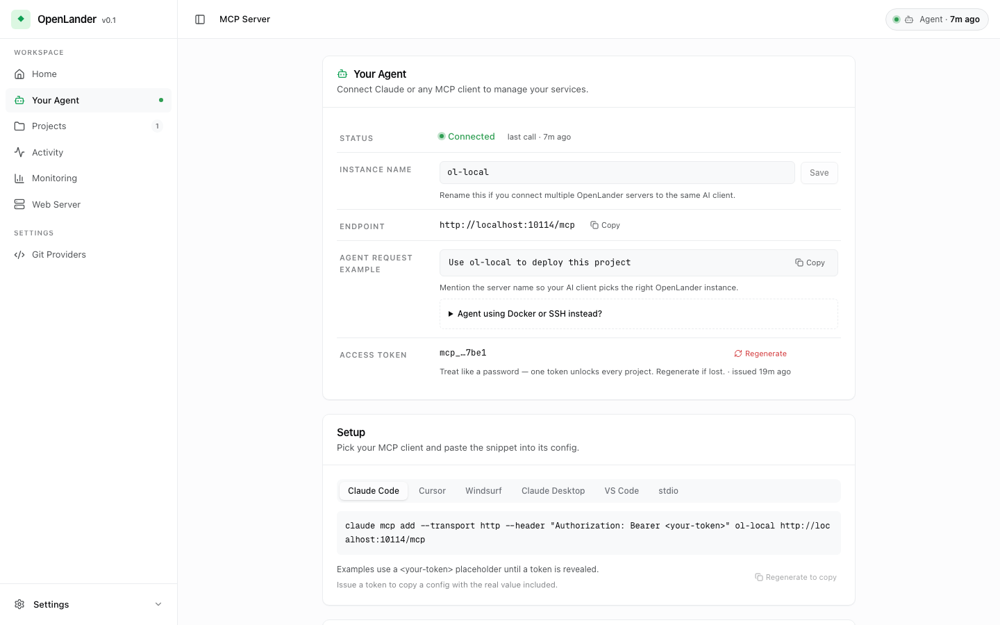
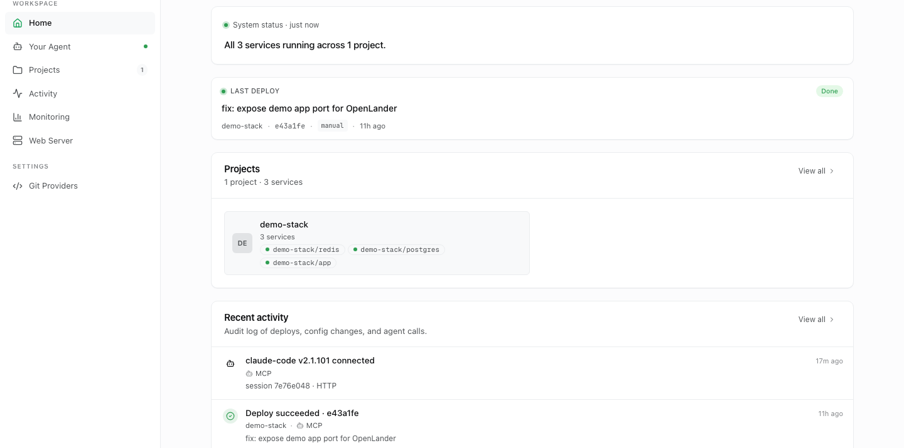

# OpenLander

**MCP-native deployment control plane for coding agents.**

[](https://www.gnu.org/licenses/agpl-3.0)
[](https://github.com/openlander-ai/openlander/releases)

[Quickstart](#quickstart) · [Current status](#current-status) · [Why OpenLander?](#why-openlander) · [Agent evals](#agent-operability-evals) · [MCP tools](docs/wiki/MCP-Tools-Reference.md)

OpenLander lets coding agents deploy, inspect, diagnose, and operate apps on
your own server, with risky actions gated by human approval.

<p align="center">
  
</p>

---

## Quickstart

```bash
curl -fsSL https://raw.githubusercontent.com/openlander-ai/openlander/main/install.sh | sudo bash
```

Want to inspect it first? Download
[`install.sh`](https://raw.githubusercontent.com/openlander-ai/openlander/main/install.sh)
and read it before running with `sudo bash`.

The installer sets up Docker/Compose if needed, starts the published
`ghcr.io/openlander-ai/openlander:latest` image with Postgres, and prints the
dashboard URL. Open it, create the admin password, then copy the MCP token into
your coding agent from the **Your Agent** page (`/mcp-server`).

On a cloud VM, allow inbound TCP `80` for deployed app routes and TCP `10114`
for the OpenLander dashboard/MCP endpoint. If those ports are blocked by a
security group or host firewall, the installer can succeed while the printed
URLs remain unreachable.

Try a small public demo app after connecting your agent:

```text
Deploy https://github.com/openlander-ai/openlander-demo-app to OpenLander.
Use the default branch and health check path /health.
```

OpenLander should build the Dockerfile, start the app, and return a URL like
`http://openlander-demo.<server-ip>.sslip.io` without requiring a custom
domain.

If your server has a public domain or a preferred LAN IP, set it before
installing so OpenLander advertises reachable app URLs:

```bash
curl -fsSL https://raw.githubusercontent.com/openlander-ai/openlander/main/install.sh \
  | sudo env OPENLANDER_PUBLIC_HOST=apps.example.com bash
```

The public `0.1.x` releases use a fresh Postgres baseline. If you ran a
pre-public dogfood build, start from a new Postgres volume or export/import data
manually before upgrading.

Update later with:

```bash
curl -fsSL https://raw.githubusercontent.com/openlander-ai/openlander/main/install.sh | sudo bash -s update
```

If the dashboard password is lost, installations created by the quick
installer provide an interactive recovery command:

```bash
sudo openlanderctl admin reset-password
```

The password is entered through a hidden terminal prompt, never a command-line
argument, and the reset signs out existing dashboard sessions.

Prefer manual setup? Download
[`docker-compose.runtime.yml`](docker-compose.runtime.yml) and run
`docker compose -f docker-compose.runtime.yml up -d`.

For agent setup details, see [MCP Tools Reference](docs/wiki/MCP-Tools-Reference.md).

---

## Current status

OpenLander v0.1 is an early public preview.

It is good for:

- trusted self-hosted servers
- side projects and small apps
- agent-assisted deployment workflows
- cheap VPS, homelab, and small server setups

It is not yet:

- a mature general-purpose PaaS
- a production-grade multi-tenant sandbox
- a Nomad or Kubernetes replacement
- a fully self-healing PaaS
- a one-click importer for existing Docker/PaaS workloads
- safe for running arbitrary untrusted code without additional isolation

OpenLander controls Docker on the host and is intended for trusted self-hosted
environments. Do not expose the dashboard or MCP endpoint publicly without
authentication, TLS, and network-level protection.

---

## Why OpenLander?

AI coding agents made building software faster, but deployment is still a
bottleneck. Cloud platforms get expensive; self-hosting is cheaper, but most
deploy tools assume a human is clicking the dashboard. Agents can hit a REST
API, but they often don't get the context they need to debug a failed build,
inspect runtime state, or recover safely.

OpenLander's core operations are protocol-independent. v0.1 ships with MCP as
the first supported adapter because it is the most practical interface current
coding agents can use. OpenLander exposes deploys, logs, services, approvals,
and runtime state in a shape agents can read, with risky actions held behind
explicit human approval.
Environment variables and secrets are masked by default in MCP responses; raw
values are only returned through explicit reveal operations.

### Agent-shaped failure responses

OpenLander does not only expose deploy endpoints. It returns failure context in
a shape an agent can act on.

```json
{
  "status": "failed",
  "phase": "healthcheck_wait",
  "deploy_id": "dep_123",
  "service_id": "svc_123",
  "error": "container exited before the health check passed",
  "diagnostic_call": {
    "tool": "openlander_monitor",
    "action": "diagnose_service",
    "params": {
      "service_id": "svc_123"
    }
  },
  "_agent_guidance": {
    "next_steps": [
      "Call diagnose_service to inspect logs, env shape, container state, and dependency probes.",
      "Fix the issue, then redeploy the service."
    ]
  }
}
```

A generic API gives an agent endpoints. OpenLander gives it status, IDs,
diagnostics, and the next call shape needed to keep working.

OpenLander 0.1 does not run an internal self-healing agent. It gives external
MCP-capable coding agents structured tools and context to deploy, inspect,
diagnose, and recover services explicitly. It assumes a trusted self-hosted
environment, not a multi-tenant sandbox for arbitrary untrusted code.

<p align="center">
  
  <br />
  <sub>Connect your AI client once, then let it deploy, inspect logs, and diagnose services through MCP.</sub>
</p>

---

## Agents operate. You intervene.

Most deploy platforms assume a human sits in front of the dashboard, reads the
form, and clicks the button. OpenLander is built the other way around.

**Agents do the work.** v0.1 supports MCP out of the box, so Claude Code,
Cursor, OpenCode, Cline, Windsurf, and Codex can drive deploys, redeploys, log
inspection, and recovery through OpenLander today.

**Guardrails are built in.** Agents get org- and project-scoped tokens.
Destructive MCP actions are either blocked outright or held for human
approval. The dashboard surfaces what the agent did, what's pending, and
what's blocked — so you stay in the loop without staying at the keyboard.

OpenLander is a control plane built for agentic operation; the dashboard
is the human surface on top.

---

## Agent operability evals

I test OpenLander with coding agents, not just API smoke tests — a sanity check
for the agent-native direction, not a PaaS ranking or a "faster / solved
everything" claim.

- **Question:** can smaller agents stay on safe, high-level workflows for common
  deploy and update tasks?
- **Fixture:** a small Node app with managed Postgres + Redis.
- **Rows:** repeat runs from Codex/GPT and Claude models, reported separately
  so release lines and model families are not mixed.
- **Product Gate (pass/fail), scenario-specific:** initial deploy → app live,
  `/health` 200, DB write/read, Redis counter increments, advertised URL serves,
  app/DB/cache in one project/network; bad-runtime update → the bad candidate
  stays off the public route, the previous version keeps serving, and the failure
  is reported honestly.

| Scenario                                         | Result                                                                                                                                                                                                                                      |
| ------------------------------------------------ | ------------------------------------------------------------------------------------------------------------------------------------------------------------------------------------------------------------------------------------------- |
| Initial deploy: app + managed Postgres + Redis   | Spark, Mini, Claude Haiku, and Claude Sonnet each **passed the Product Gate 3/3**. Haiku took heavier inert-shell / path detours (Tool Discipline deductions, no infra mutation); Sonnet stayed mostly on the composite path with no shell. |
| Bad-runtime update: broken candidate after build | Spark, Mini, Claude Haiku, and Claude Sonnet each **passed the Product Gate 3/3**: bad candidate never public, previous version kept serving, failure reported honestly. Haiku and Sonnet both used the no-strategy path, never forced.     |

Agent behavior is scored separately from product correctness: detours are
operability deductions, not Product Gate failures; if the Gate fails, operability
is "not scored" rather than given a clean-looking number.

See [Agent Operability Evals](docs/evals/agent-operability.md) for methodology,
full tables, fixtures, and limitations.

---

## Mental model

- A **Project** is a workspace.
- An **Application** is a Git or image workload. It owns repository or image,
  branch, Dockerfile, build config, runtime state, and deploy history.
- A **Compose** resource is one Project-level stack; its containers stay inside
  that stack surface.
- A **Database/Cache/Storage resource** is infrastructure such as Postgres, MySQL, Redis,
  MongoDB, Neo4j, or MinIO. In v0.1 these are project-scoped: they attach to the
  project that uses them and run on that project's Docker network. Cross-project
  shared Database/Cache/Storage resources and external TCP exposure are deferred.

Existing Docker/PaaS workloads can be migrated with operator-assisted guidance
today. Automatic import/adoption of existing containers, networks, and volumes
is planned after v0.1.

The dashboard and MCP both expose a one-step "deploy this repo" path for the
common single-Application case.

---

## Features

**Deployment**

- Git → Docker → URL pipeline. Auto-detects ports, proxies, and containers
  before deploying.
- Deploy apps from public Git repos, connected private GitHub repos, or public
  container images, and provision
  project-scoped Postgres, MySQL, Redis, MongoDB, Neo4j, and MinIO services alongside
  them. Private container registry support is on the roadmap.
- Cancel a stuck build mid-flight. The cancel goes through the same SSE log
  channel agents are watching.

**Observability**

- Live SSE log stream with phase markers (`clone`, `image_pull`, `build`,
  `container_start`, `healthcheck_wait`).
- Service health and runtime status with last-seen timestamps.
- Activity timeline filterable by actor (MCP / human / system).

**Agent control**

- MCP server bundled in. Org- and project-scoped tokens with cross-project
  scope checks. Per-project audit trail.
- Env vars and secrets are masked by default in MCP responses, so agents can
  inspect configuration shape without automatically receiving raw secret values.
- Conservative built-in safety policy. Project and app archive/delete flows
  are human UI-only. Destructive MCP actions that remain exposed are either
  blocked at the MCP boundary or held in a human approval queue before
  execution.

**Delivery Workspace Beta**

- Create a Delivery inside a Project, preserve HTML/PDF review artifacts and
  pasted Slack/email/meeting feedback, and let an external MCP agent propose
  structured decisions, change requests, questions, and notes.
- Keep approval and finalization human-controlled in the dashboard. OpenLander
  records external Review/QA/Data Gate results and successful Production deploy
  evidence; it does not run QA or a built-in LLM.
- Generate an immutable Receipt PDF containing OpenLander evidence pages,
  hashes, approvals, Gate/deploy snapshots, and every approved companion PDF.
  Customers do not need an OpenLander account.

**Self-hosted**

- The one-command installer sets up Docker/Compose if needed. Manual
  `docker compose` setup is still supported.
- Postgres ships in the same compose file; no external database required.
- Traefik handles routing for deployed services. TLS depends on your domain
  / proxy setup.

<p align="center">
  
  <br />
  <sub>The dashboard stays focused on what the agent did: project health, latest deploys, service topology, and audit activity.</sub>
</p>

---

## MCP setup

OpenLander runs an MCP server out of the box. Endpoints:

```
HTTP  http://<host>:10114/mcp
SSE   http://<host>:10114/mcp/sse
```

Per-client snippets (Cursor, Claude Desktop, Claude Code, OpenCode, Cline,
Windsurf, Codex) live in
[docs/wiki/MCP-Tools-Reference.md](docs/wiki/MCP-Tools-Reference.md).

---

## Roadmap

The shape of v0.2 is driven by what makes agentic operation more reliable.

**Current (v0.1)**

- Git-to-URL deploy pipeline.
- MCP server with deploy / inspect / operate tools.
- Dashboard for human oversight + intervention.
- Project-scoped Database/Cache/Storage resources for Postgres, MySQL, Redis,
  MongoDB, Neo4j, and MinIO through agent/MCP workflows.
- Managed-service memory controls with live increases and persistent recovery settings.
- Deterministic post-deploy recovery primitives for external agents: structured
  `diagnose_service` findings, safe route re-pointing, same-image runtime env
  apply, verification details, and rollback when a hot path fails.
- Delivery Workspace Beta for FDE review, approval, Gate, deployment evidence,
  and immutable customer-facing Receipt PDFs, plus an Engagement Portfolio for
  cross-Project runtime health and delivery blocker rollups.

**Next**

- **Verified Failure Tickets** — turn runtime failures into MCP-readable tickets
  that agents can triage without opening the dashboard.
- **Recovery Receipts** — make `diagnose_service(briefing_id)` return a clear
  before/after verification result so agents can report whether a fix is really
  serving.
- **Agent-primary triage** — keep the web dashboard as the human inbox / audit
  surface while the happy path starts from MCP (`list_ai_ops_briefings` →
  `get_ai_ops_briefing` → `diagnose_service`).
- **Environment contract** — first-class project, deployment-target, service,
  and generated runtime variable scopes, with clear redeploy guidance.
- **Private container registries** — AWS ECR, Google Artifact Registry, and
  any OCI registry behind cloud-provider auth.
- **Service templates** — beyond Postgres / Redis. Object storage, message
  queues, search, vector DBs.
- **Deployment targets** — production/development target policy first, designed
  so staging can be added later without a rewrite.
- **Notifications** — Slack and Discord webhooks for deploy / health /
  approval events.
- **Internal AI Ops** — deferred until deterministic ticket, receipt, approval,
  and audit contracts are strong enough to support it without a chat-first
  automation path.

If a roadmap item matters to you, opening an issue moves it up the queue
more than waiting for it does.

---

## Requirements

- Linux server with root/sudo access for the one-command installer
- Docker Engine with the Docker Compose v2 plugin for manual installation
- ~1 GB free RAM for OpenLander + the bundled Postgres
- A host that can expose port `10114` (or whatever you map)
- Node.js 22+ for development; runtime ships in the Docker image

OpenLander has been used on Linux servers, homelab machines, Apple Silicon,
and inside Tailscale-only networks. Published runtime images support
`linux/amd64` and `linux/arm64`.

### Installing Docker

The quick installer does this for Linux servers. For manual setup:

```bash
# Linux / WSL2
curl -fsSL https://get.docker.com | sh
sudo usermod -aG docker $USER
docker run --rm hello-world

# macOS
brew install --cask docker
```

Verify Docker Compose v2 is present (most installers include it, but some
minimal Linux setups do not):

```bash
docker compose version
```

If the command is not found, install the Compose plugin:

```bash
# Debian / Ubuntu
sudo apt-get update && sudo apt-get install -y docker-compose-plugin

# Other distros: https://docs.docker.com/compose/install/linux/
```

---

## Development

```bash
git clone https://github.com/openlander-ai/openlander
cd openlander
npm install
cd web && npm install && cd ..
npm run build
npm test
```

Run the dev server (builds from `Dockerfile`, no GHCR pull):

```bash
docker compose up -d
```

See [CONTRIBUTING.md](CONTRIBUTING.md) for branch conventions, test policy,
and PR layout.

---

## Contributing & License

Issues and PRs are welcome. Read [CONTRIBUTING.md](CONTRIBUTING.md) and
[CODE_OF_CONDUCT.md](CODE_OF_CONDUCT.md) before opening a PR. Security
reports go through [SECURITY.md](SECURITY.md), not public issues.

[AGPL-3.0](LICENSE). Third-party notices live in
[THIRD_PARTY_NOTICES.md](THIRD_PARTY_NOTICES.md).
